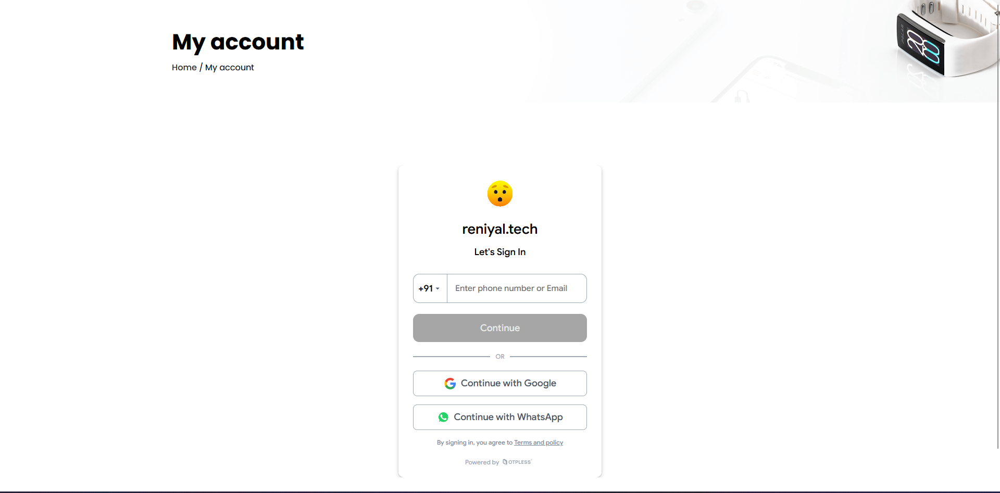
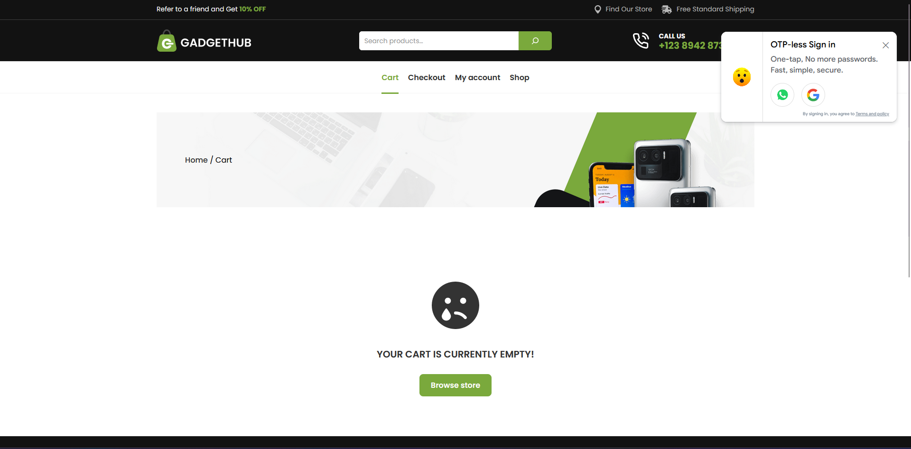

[](https://otpless.com/platforms/wordpress)

# WordPress Integration Steps

### Step 1 : Install OTPless WordPress Plugin

- Click [here](https://wordpress.com/plugins/otpless) or Navigate to `Add New Plugins` Search for `otpless` and **install** it.
    

### Step 2 : Activate Plugin

- Click on `Activate Plugin` and **Activate** it.
    

- Navigate to `Settings>OTPless` and signup @ otpless.com using your email and phone(work email(something@your-domain) is highly recommended)
    
    

### Step 3 : Configure Plugin

> Choose your desired integration options from this settings page.
    

- To view OTPless in any custom page other than `my-account`. ***Toggle off*** `OTPless Signin on my-account page` and add the the following `shortcode` to the page of your choice

    ```shortcode
    [otpless-signin]
    ```

- To disable OTPless floater ***Toggle off*** `OTPless Social Sign in widget`.

### Step 4 : Finally You can visit OTPless Dashboard for further configuration and customizations

- Visit [OTPless Dashboard](https://otpless.com/dashboard/app).

- Navigate to Settings for your app and customize your integration further.

### Final Outputs

> OTPless Page - your_site.com/my-account

> OTPless Floater


## THANK YOU
